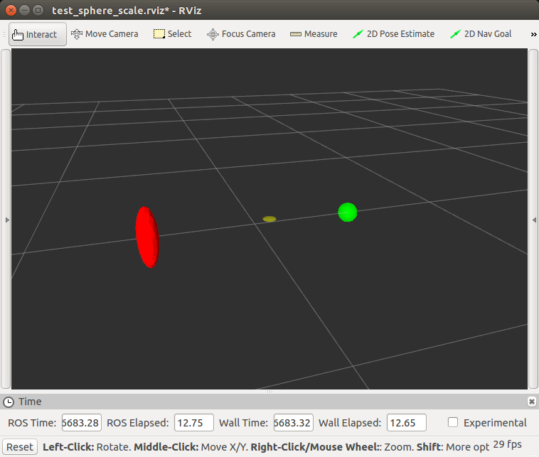

# Test Sphere Scale

This package illustrates an issue with irregular scaling of sphere markers (i.e. ellipsoids) when using the `SPHERE_LIST` marker type.

When running the provided launchfile, two _identical_ sphere markers are published, one using `SPHERE` type and the other using `SPHERE_LIST`.
The outcome is that the `SPHERE` marker correctly renders an ellipsoid, while the `SPHERE_LIST` marker draws a regular sphere using the `x` value of the scale uniformly.

